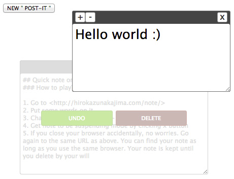

# post-it
=======

***
## Quick note on browser 
### How to play?
1. Go to <http://hirokazunakajima.com/note/>
2. Put some words on it
3. Change font size using + , - symbols if you want
4. Get note to be suspending mode by clicking x button
5. If you close your browser accidentally, no worries. Go again to the same URL as above. You can find your note as long as you use the same browser. Your note is kept until you delete by your will